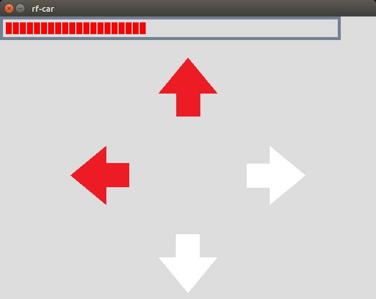
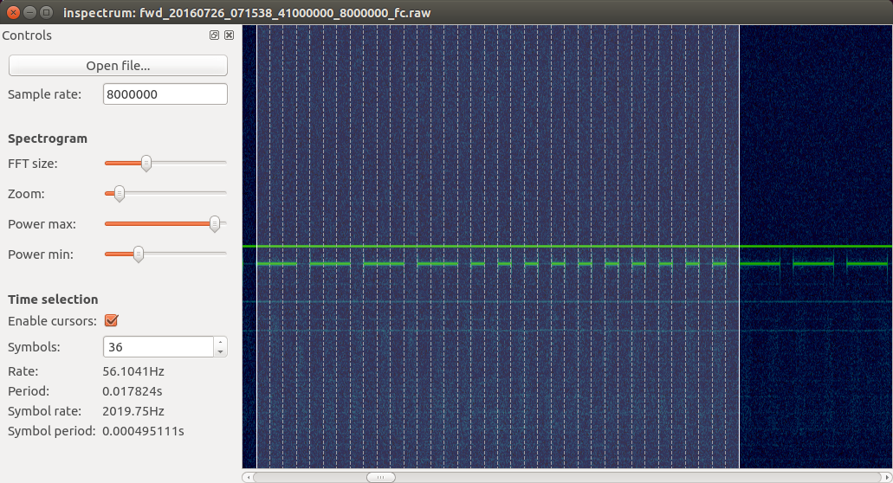

rf-car
------
Bu HackRF ilə RC avtomobillərinə nəzarət etmək üçün kiçik bir proqramdır. RC oyuncaqlarının əksəriyyəti eyni protokoldan istifadə edir, buna görə oyuncağın işlədiyi tezliyi tapmaq lazımdır. Mənim vəziyyətimdə 40.684 MHz-dir. RC oyuncağınız 8 istiqamətdə (irəli, geriyə, sola, sağa, irəli-sağa, irəli-sola, geriyə-sağa, geriyə-sola) hərəkət edə bilərsə, bu proqramı idarə etmək üçün istifadə edə biləcəyiniz böyük bir şans var. .

Bunu hərəkətdə görə bilərsiniz:

Proqram necə işləyir
Uzaqdan idarəetmə uzun və qısa pulslarla OOK modulyasiyasından istifadə edir. Bir uzun nəbz üç qısa nəbzə bərabərdir. Məsələn, avtomobili irəliyə aparmaq üçün 4 uzun puls göndərmək lazımdır, ardınca 10 qısa pulsasiya. RC-dən siqnal yazmaqla hər istiqamətə nəzarət ardıcıllığını asanlıqla tapa bilərik və sonra inspectrum ilə təhlil edə bilərik :

Siqnalı HackRF ilə sintez etmək SAMPLE_RATE/SYMBOL_RATEüçün, nəzarət ardıcıllığının hər biti üçün nümunələr ('1' və ya '0') ötürməliyik . SYMBOL_RATEYoxlama ilə tapa bilərik, təxminən 2018-dir. Biz SAMPLE_RATE2M olacağıq.

Qurlaşdırmaq & run
-----------
Proqram yalnız SDL2, SDL2_image və libhackrf-dən asılıdır. Linux üzərində qurmaq:

    $ sudo apt-get install libsdl2-dev libsdl2-image-dev libhackrf-dev
    $ make
    $ ./rf-car

To build on OSX::

    $ brew install sdl2 sdl2_image hackrf
    $ make
    $ ./rf-car

